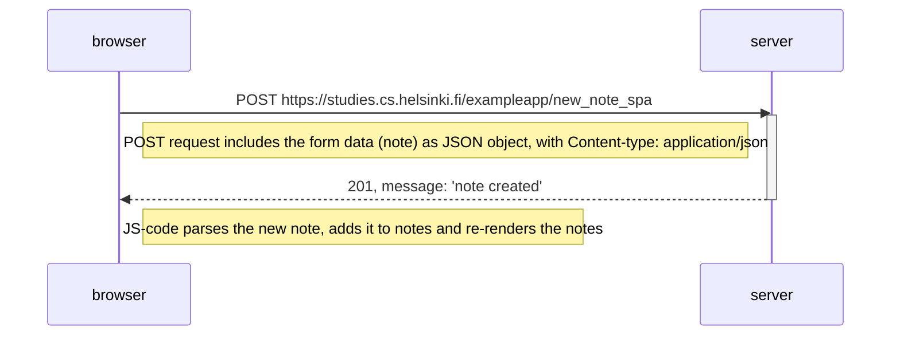

```mermaid
sequenceDiagram
    participant browser
    participant server

    browser->>server: POST https://studies.cs.helsinki.fi/exampleapp/new_note_spa
    activate server
    Note right of browser: POST request includes the form data (note) as JSON object, with Content-type: application/json
    server-->>browser: 201, message: 'note created'
    deactivate server


    Note right of browser: JS-code parses the new note, adds it to notes and re-renders the notes
```
